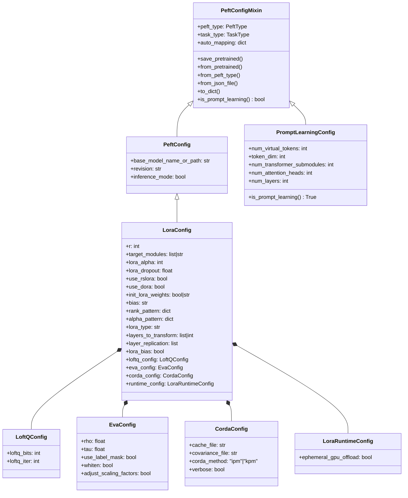
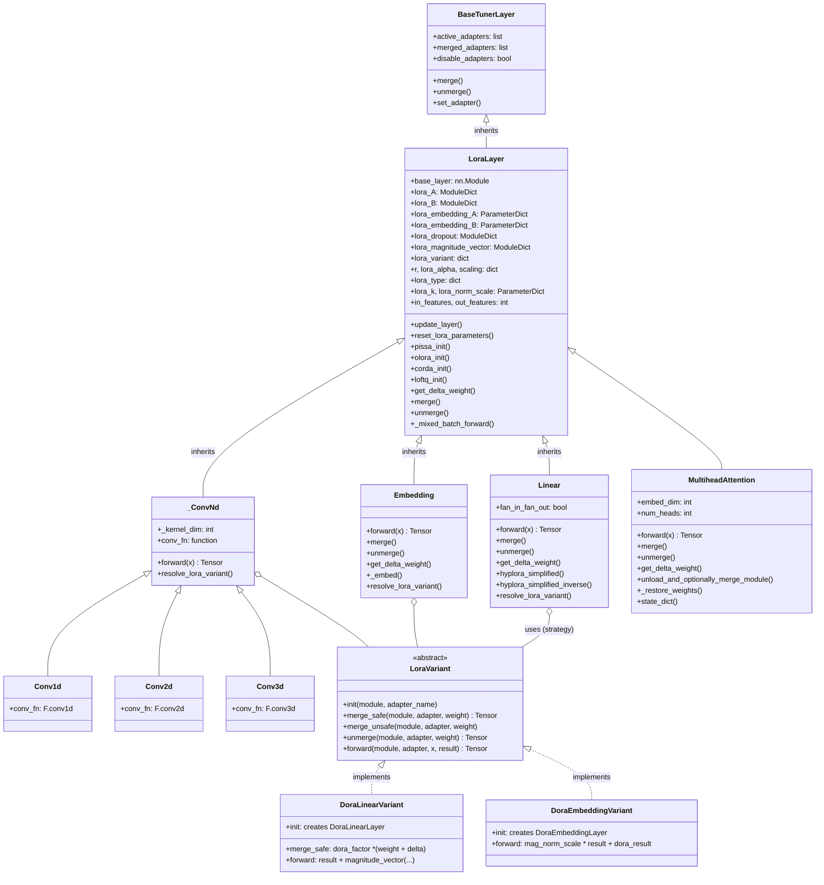
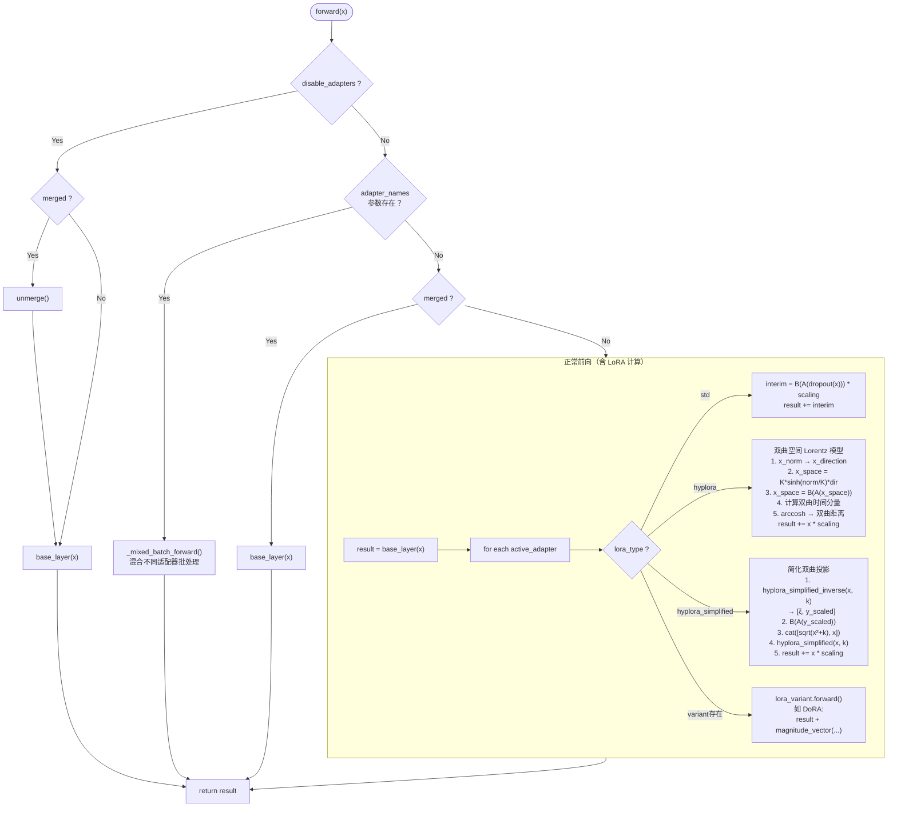
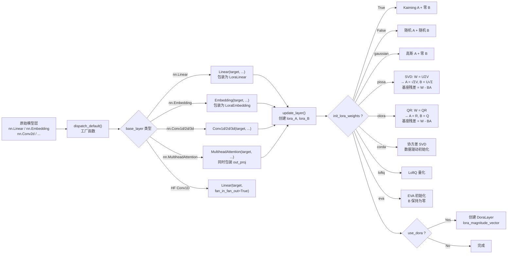
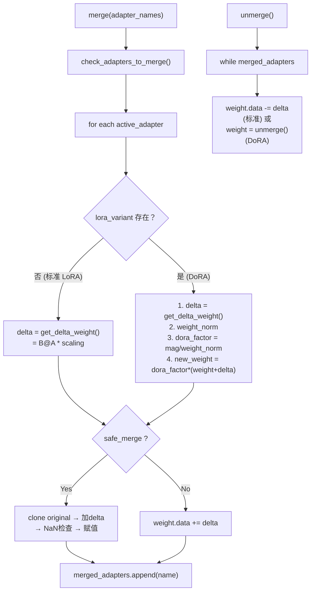
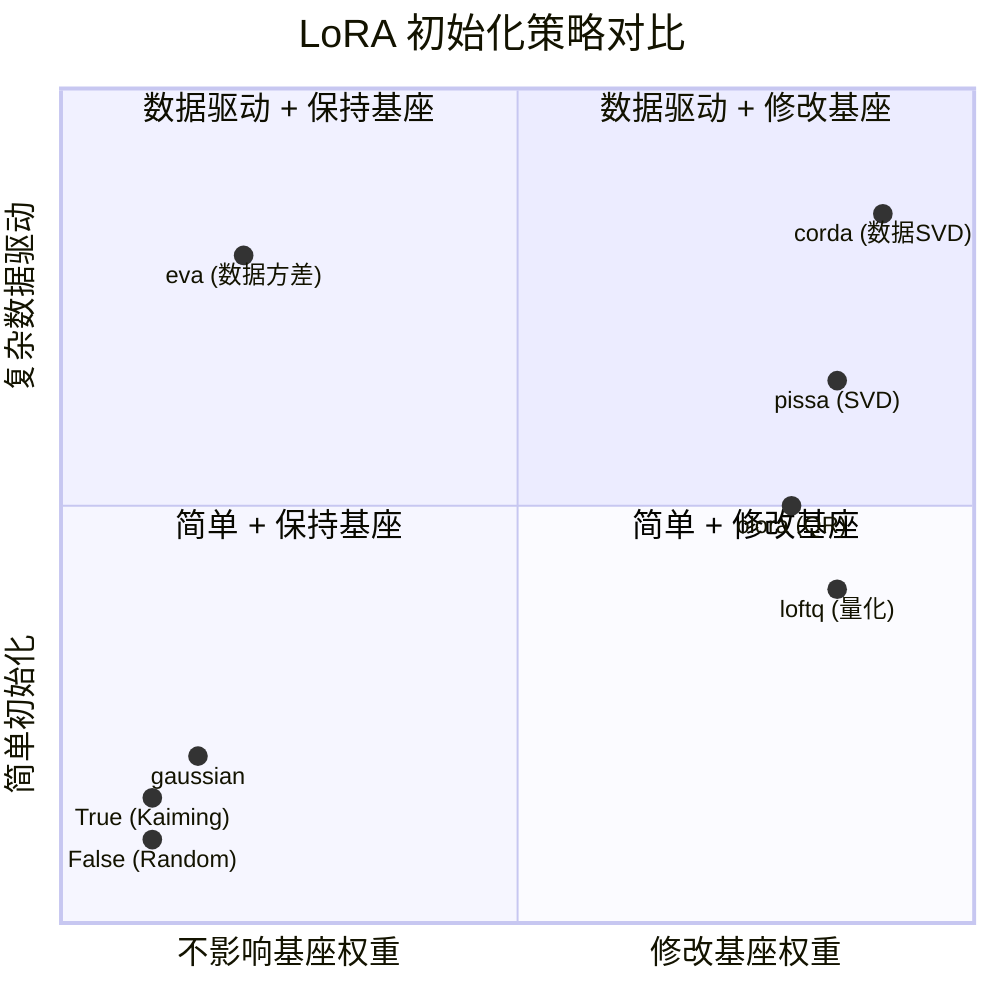
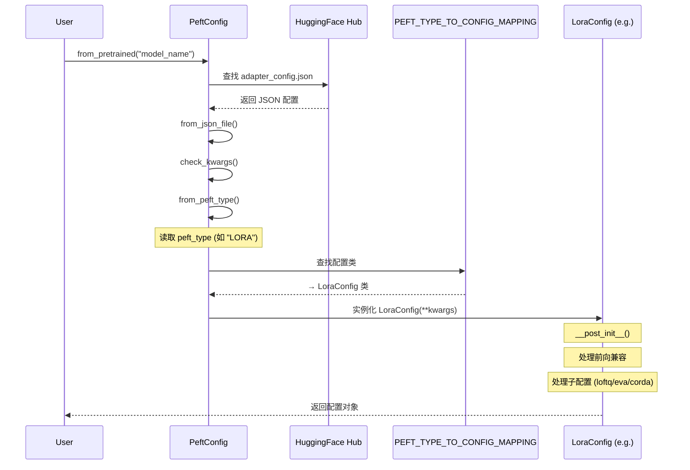
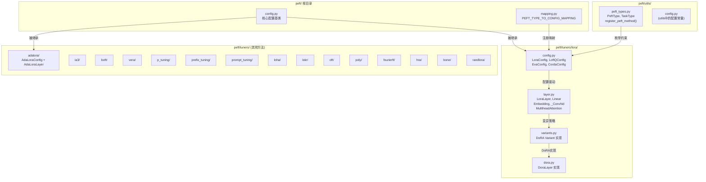

# PEFT Config & Layer 可视化图谱

## 1. 配置类继承关系图

---

## 2. LoRA Layer 类体系

---

## 3. 前向传播流程图

---

## 4. 模块替换流程

---

## 5. 合并与分离 (Merge/Unmerge)

---

## 6. 初始化策略对比

---

## 7. 配置加载流程

---

## 8. 完整文件结构

